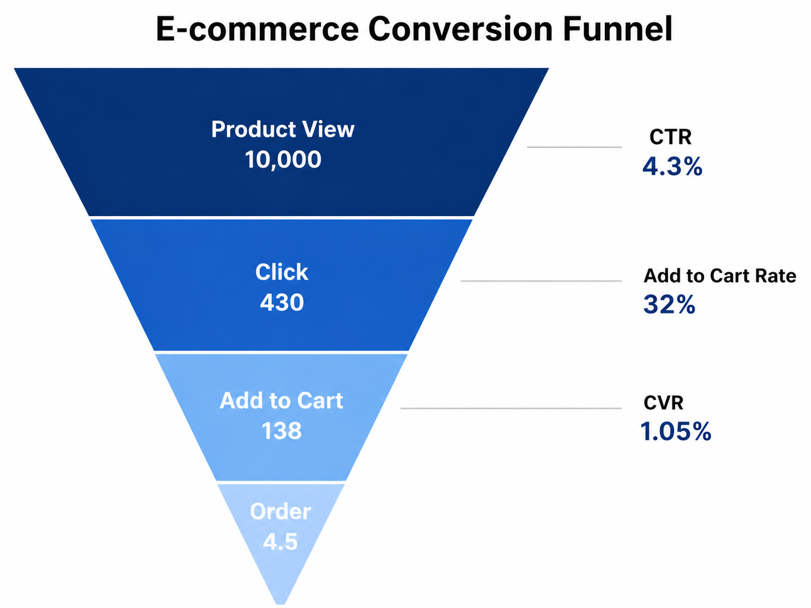

# E-commerce Growth Strategy & Analytics

## 📌 Problem
The e-commerce platform aimed to expand its third-party (3P) marketplace but faced supply gaps in specific product categories, limiting assortment coverage and overall revenue growth. In addition, limited visibility into product performance and customer conversion behavior made it difficult to prioritize high-impact opportunities.

---

## 💡 Solution
As part of a consulting team supporting 3P business expansion, I led dashboard development and thematic analysis to enhance data visibility and support decision-making.

Key contributions:
- Built automated dashboards to track core business metrics (GMV, Conversion Rate, Purchasing Users)
- Identified product assortment gaps and prioritized high-opportunity categories
- Designed customer funnel analysis to diagnose conversion drop-offs
- Delivered recurring analytical insights to internal stakeholders and client teams

---

## 🔍 Highlights
- Automated recurring reporting workflows, significantly improving operational efficiency
- Developed KPI frameworks linking traffic → conversion → GMV
- Identified high-traffic but low-conversion product segments as key growth opportunities,
and low-traffic but high-conversion products as opportunities to scale through increased exposure
- Translated analysis into actionable insights for daily business decisions

---

## 📈 Impact
- Contributed to 3% YoY GMV growth by identifying supply gaps and high-impact optimization opportunities in the 3P marketplace
- Increased reporting efficiency by 4x through automation, significantly reducing manual workload
- Enabled faster and more effective data-driven decision-making for both internal teams and client stakeholders  

---

## 🧠 Framework

This funnel illustrates key drop-off points across the customer journey. CTR, Add-to-Cart Rate, and CVR are used to evaluate conversion efficiency and identify opportunities to improve engagement and purchase performance.
