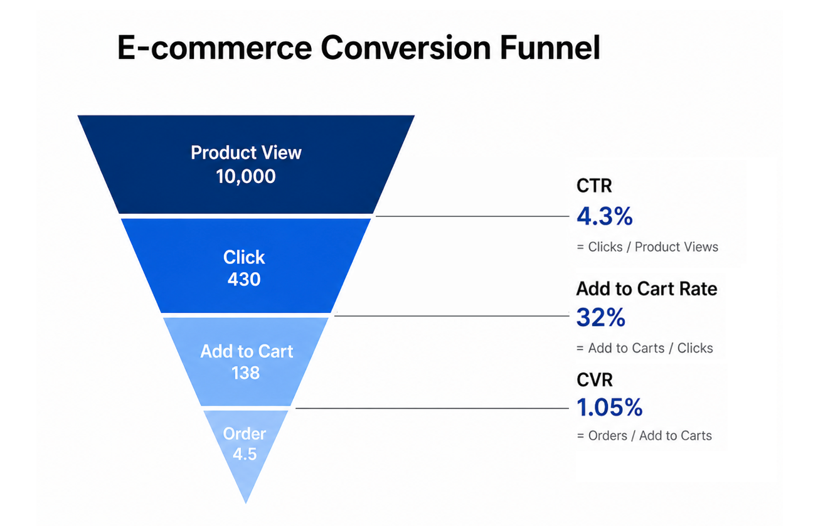

# E-commerce Growth Strategy & Analytics

## 📌 Problem
The e-commerce platform aimed to expand its third-party (3P) marketplace but faced supply gaps in specific product categories, limiting assortment coverage and overall revenue growth. In addition, limited visibility into product performance and customer conversion behavior made it difficult to prioritize high-impact opportunities.

---

## 💡 Solution
As part of a consulting team supporting 3P business expansion, I led dashboard development and thematic analysis to enhance data visibility and support decision-making.

Key contributions:
- Built automated dashboards to track core business metrics (GMV, Conversion Rate, Purchasing Users)
- Identified product assortment gaps and prioritized high-opportunity categories
- Designed customer funnel analysis to diagnose conversion drop-offs
- Delivered recurring analytical insights to internal stakeholders and client teams

---

## 🔍 Highlights
- Automated recurring reporting workflows, significantly improving operational efficiency
- Developed KPI frameworks linking traffic → conversion → GMV
- Identified high-traffic but low-conversion product segments as key growth opportunities,
and low-traffic but high-conversion products as opportunities to scale through increased exposure
- Translated analysis into actionable insights for daily business decisions

---

## 📈 Impact
- Contributed to 3% YoY GMV growth by identifying supply gaps and high-impact optimization opportunities in the 3P marketplace
- Increased reporting efficiency by 4x through automation, significantly reducing manual workload
- Enabled faster and more effective data-driven decision-making for both internal teams and client stakeholders  

---

## 📊 KPI Framework

Core KPI relationship:

GMV  
→ Orders  
→ CVR (Conversion Rate)  
→ CTR (Click-Through Rate)  
→ Exposure (Search / Recommendation)

This framework represents the end-to-end e-commerce performance funnel, linking traffic, engagement, conversion, and revenue into a unified analytical structure.

Key metric structure:

- **Traffic (Exposure)**
  - Search Exposure
  - Recommendation Exposure
  - Total Exposure  

- **Engagement**
  - CTR (Click-Through Rate) = Clicks / Impressions  

- **Conversion**
  - CVR (Conversion Rate) = Orders / Clicks  

- **Transaction**
  - Orders  
  - Purchasing Users  
  - New Users  

- **Revenue**
  - 3P GMV
  - AOV (Average Order Value)  
  - ASP (Average Selling Price)  

- **Growth Metrics**
  - MoM% (Month-over-Month Growth)  
  - YoY% (Year-over-Year Growth)  

This structure supports systematic diagnosis of performance across the funnel and helps identify key drivers of growth.

---

## 📊 Dashboard — Performance Monitoring

This dashboard demonstrates how e-commerce performance can be monitored in a real business environment using a funnel-based KPI framework.

It integrates traffic sources (search vs. recommendation), user behavior, and conversion outcomes into a unified analytical view.

Key features:

- **Traffic Breakdown**
  - Separate tracking of search and recommendation exposure  
  - Combined exposure metrics for overall performance evaluation  

- **Funnel Analysis**
  - Exposure → CTR → CVR → Orders → GMV  
  - Identification of drop-off points across the customer journey  

- **Dynamic KPI Analysis**
  - Toggle between search, recommendation, and combined metrics  
  - Support flexible performance comparison across dimensions  

- **Growth Tracking**
  - MoM% and YoY% for trend analysis  
  - Monitoring performance changes over time  

The dashboard enables:

- Monitoring performance across each stage of the funnel  
- Quickly identifying where bottlenecks occur (traffic, engagement, or conversion)  
- Tracking overall performance trends and growth over time  

> *Note: This visualization is a mockup for demonstration purposes only and does not represent real business data.*

---

## ✏️ Conceptual Illustration

This funnel illustrates key drop-off points across the customer journey. CTR, Add-to-Cart Rate, and CVR are used to evaluate conversion efficiency and identify opportunities to improve engagement and purchase performance.

> *Note: All figures shown are for illustrative purposes only and do not represent actual business data.*
